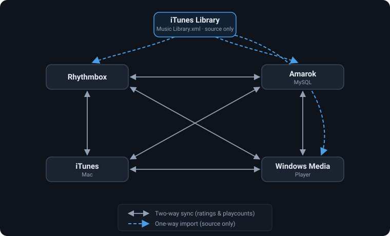

# iTunesToRhythm

Transfer your **ratings** and **play counts** between music players: iTunes, Rhythmbox, Amarok, and Windows Media Player, with read-only support for Amazon Music.



## Supported players

| Player | How to specify it | Read | Write |
| --- | --- | :---: | :---: |
| iTunes library XML (`iTunes Music Library.xml`) | path to the file | ✅ | ✅ |
| Rhythmbox (`rhythmdb.xml`) | path to the file | ✅ | ✅ |
| iTunes on macOS (running instance) | `itunes` | ✅ | ✅ |
| iTunes on Windows (COM API) | `itunes` | ✅ | ✅ |
| Amarok (MySQL database) | `mysql` plus the Amarok options | ✅ | ✅ |
| Windows Media Player | `wmp` | ✅ | ✅ |
| Amazon Music desktop app (Windows) | `amazonmusic` | ✅ | ❌ |

File inputs are detected automatically: an iTunes XML library or a Rhythmbox `rhythmdb.xml` is recognized from its contents.

## Requirements

- Python 3
- [lxml](https://lxml.de/) (all XML-based backends)

Extra packages are needed only for the backends you use:

| Backend | Package | Installed by `requirements.txt` |
| --- | --- | --- |
| iTunes on macOS | `pyobjc-framework-ScriptingBridge` | Yes, on macOS |
| iTunes on Windows, Windows Media Player | `pywin32` | Yes, on Windows |
| Amarok | `mysqlclient` (provides `MySQLdb`) | No, optional |
| Amazon Music | `rleveldb` | No, optional |

## Installation

```sh
git clone https://github.com/esanbock/ITunesToRhythm.git
cd ITunesToRhythm
pip install -r requirements.txt
```

This installs lxml plus the iTunes/WMP packages for your platform. The Amarok and Amazon Music packages are optional; uncomment them in `requirements.txt` (or `pip install` them directly) if you need them.

## Usage

```
python iTunesToRhythm.py [options] <source> <destination>
```

`<source>` and `<destination>` can each be a file path or one of `itunes`, `mysql`, `wmp`, `amazonmusic`.

For every song in the destination, the tool looks for the matching song in the source, by file size by default, then copies the rating and play count across.

> **Nothing is written unless you pass `-w`.** Without it the tool runs as a dry run and prints what it would change. Back up your library files before writing to them.

### Options

| Option | Description |
| --- | --- |
| `-w`, `--writechanges` | Write changes to the destination (otherwise a dry run) |
| `-a`, `--disambiguate` | Prompt you to pick the right song when a match is ambiguous |
| `-c`, `--confirm` | Pause after every match for confirmation |
| `-l`, `--fastandloose` | Accept a single file-size match even if the titles differ |
| `--useSongTitle` | Match songs by title instead of file size |
| `--noratings` | Don't update ratings |
| `--noplaycounts` | Don't update play counts |
| `--twoway` | Sync both directions; for each song, the copy with the higher play count wins |
| `--dateadded` | Also copy the "date added" field (iTunes to Rhythmbox only) |
| `--playdate` | Also copy the "last played" date (between iTunes library files and Rhythmbox only) |

Amarok connection options, used with `mysql`:

| Option | Description |
| --- | --- |
| `-s`, `--server` | MySQL server host name |
| `-d`, `--database` | Amarok database name |
| `-u`, `--username` | Database user |
| `-p`, `--password` | Database password |

## Typical workflow: moving from iTunes to Rhythmbox

1. Copy or mount your music somewhere Rhythmbox can see it. The folder structure doesn't matter.
2. Import the music into Rhythmbox, then close Rhythmbox so it doesn't overwrite the database.
3. Copy your `iTunes Music Library.xml` to the Linux machine.
4. Do a dry run and review the output:

   ```sh
   python iTunesToRhythm.py -a "iTunes Music Library.xml" ~/.local/share/rhythmbox/rhythmdb.xml
   ```

5. Run it again with `-w` to save the changes:

   ```sh
   python iTunesToRhythm.py -w -a "iTunes Music Library.xml" ~/.local/share/rhythmbox/rhythmdb.xml
   ```

At the end of each run a summary shows how many songs matched fully, partially, ambiguously, or not at all.

## More examples

Copy play counts (not ratings) from Rhythmbox to an Amarok MySQL database:

```sh
python iTunesToRhythm.py -w --noratings -a ~/.local/share/rhythmbox/rhythmdb.xml mysql -s musicserver -d amarok -u amarokuser -p verysecret
```

Copy ratings and play counts from Amarok into iTunes on a Mac:

```sh
python iTunesToRhythm.py -w mysql -s musicserver -d amarok -u amarokuser -p verysecret itunes
```

Sync iTunes and Windows Media Player both ways on Windows:

```sh
python iTunesToRhythm.py -w --twoway itunes wmp
```

## Notes and limitations

- **Matching by file size** works well when both players point at the same audio files. If the files were re-encoded or re-tagged, try `--useSongTitle`.
- **Amazon Music** support is best-effort and Windows-only. It reads the Amazon Music desktop app's local cache, so it sees only cached tracks and can break when the app changes. It has no file sizes, so use `--useSongTitle` with it.
- Close Rhythmbox before writing to `rhythmdb.xml`, or it may overwrite your changes when it exits.

## Standalone dump scripts

Each backend module can also be run on its own to print a library's contents, which helps when debugging matches:

```sh
python dumpitunes.py "iTunes Music Library.xml"
python dumpAmazonMusic.py
```

## Running the tests

The tests use only the standard library and small sample libraries in `tests/fixtures`, so they never touch your real music libraries:

```sh
python -m unittest discover -s tests
```

Code is formatted with [Black](https://black.readthedocs.io/) (settings in `pyproject.toml`): `python -m black .`

## License

GNU General Public License v3. See [LICENSE.txt](LICENSE.txt).

Found a bug or have a feature request? [Open an issue](https://github.com/esanbock/ITunesToRhythm/issues).
